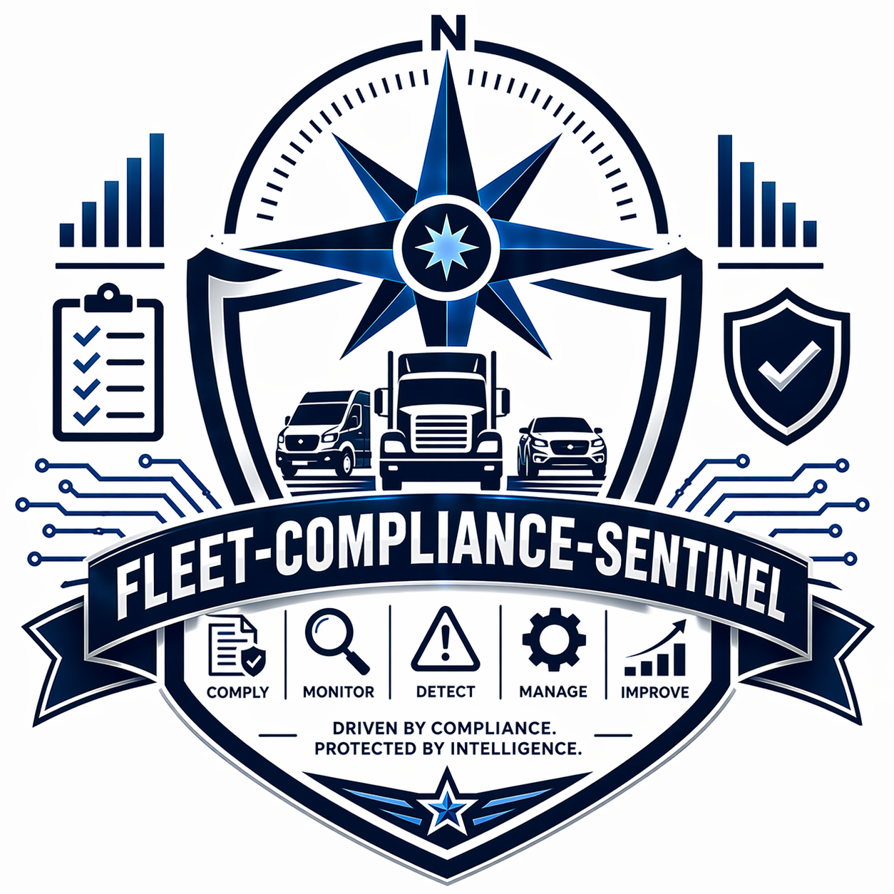

<div align="center">

# Fleet Compliance Sentinel

### Real-time DOT/FMCSA compliance for small fleet operators

[](https://nextjs.org)
[](https://typescriptlang.org)
[](https://neon.tech)
[](https://truenorthstrategyops.com)
[](LICENSE)
[](https://truenorthstrategyops.com)



</div>

---

## What this is

A multi-tenant B2B SaaS platform that gives small fleet operators real-time visibility into DOT/FMCSA compliance, employee credentials, training, dispatch, and financial operations. Built on Next.js 15 App Router with organization-scoped authentication, tenant-isolated Postgres, and a modular command architecture.

## Who it's for

Fleet owners and operations managers running 5-20 commercial vehicles who can't afford to fail an audit, can't watch everything at once, and shouldn't be piecing compliance together from spreadsheets, text messages, and paper.

## Problems it removes

- Credential expirations nobody saw coming
- Training hours that don't roll up cleanly to a report
- Driver qualification files scattered across tools
- Manual reconciliation between dispatch, compliance, and billing
- Audit prep that takes weeks of after-hours work

## What's inside

- **Command Center UI** — operator-facing dashboards for fleet status, alerts, records
- **Compliance modules** — DOT/FMCSA driver qualification, hours-of-service surfaces, credential tracking
- **Training LMS** — assignment, completion, and certification workflows
- **Onboarding orchestration** — structured intake from application to activation
- **Pipeline Penny AI** — LLM-powered regulatory assistant grounded on CFR 49 reference content
- **Telematics sync** — integration points for third-party telematics and risk scoring
- **Stripe billing** — four-tier subscription model with usage-scoped entitlements

## Architecture

```text
Next.js 15 App Router (Vercel)
  -> Clerk auth (org-scoped, tenant-isolated)
  -> Module gateway (rate limit, policy, audit)
    -> Neon Postgres (org_id scoped queries)
    -> Railway FastAPI + FAISS (Pipeline Penny AI)
  -> Resend, Sentry, Datadog, UptimeRobot, Upstash Redis
```

## Tech stack

| Layer | Technology |
|-------|------------|
| Frontend | Next.js 15, React, TypeScript, Tailwind |
| Auth | Clerk (organization-scoped) |
| Database | Neon Postgres |
| Backend AI | Railway FastAPI + FAISS vector store |
| Billing | Stripe |
| Monitoring | Sentry + Datadog + UptimeRobot |
| Rate limiting | Upstash Redis |
| Email | Resend |
| Hosting | Vercel |

## Quick start

```bash
npm install
cp .env.example .env.local   # populate required values
npm run dev
```

Visit `http://localhost:3000`. Environment keys and local-dev guidance are documented under `docs/`.

## Project structure

```text
src/                 Next.js application (pages, APIs, components, libs)
railway-backend/     FastAPI service for Pipeline Penny AI
packages/            shared workspace packages
docs/                architecture, security, operational runbooks
tooling/             command modules (fleet compliance, imports, gov compliance)
knowledge/           regulatory reference content (CFR index)
```

## Security and compliance

- SOC 2 Type I observation window active; Type I eligibility window opens June 22, 2026
- Tenant-scoped queries enforced through the module gateway
- Secret scanning + push protection enabled on this public mirror
- Public-mirror provenance documented in [SANITIZE-LOG.md](SANITIZE-LOG.md)

For production security posture, see the `docs/` directory.

## About this repo

This is a public mirror of the FCS codebase, sanitized for external review. Source-of-truth development happens in a private repository; commits flow outward after redaction passes. Issues are welcome. Pull requests are reviewed but not guaranteed to merge.

## License

MIT. See [LICENSE](LICENSE).

## Built by

**Jacob Johnston** — True North Data Strategies LLC (SDVOSB)
20-year US Army veteran, Airborne Infantry | Bronze Star
[truenorthstrategyops.com](https://truenorthstrategyops.com) | [jacob@truenorthstrategyops.com](mailto:jacob@truenorthstrategyops.com)
