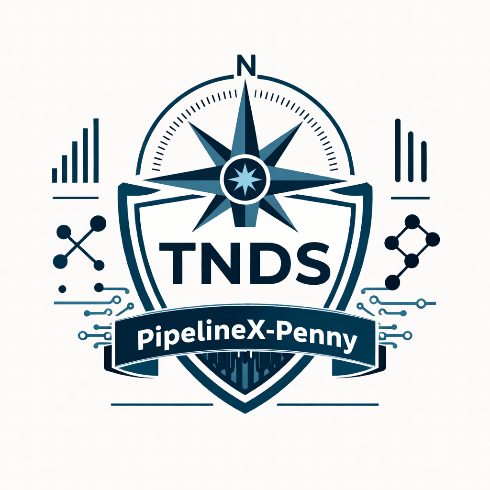

<div align="center">

# Pipeline Punks

### Build Real Systems. Get Real Skills.

Pipeline Penny is the TNDS assistant experience for documented operations, compliance, and real-world execution support.

[](https://pipelinepunks.com)
[](https://truenorthstrategyops.com)
[](https://discord.gg/eSn4cMg5SD)



</div>

---

## What Pipeline Penny Is

Pipeline Penny is a role-gated, document-grounded assistant inside the Pipeline Punks site.

It is designed to help users:

- Ask questions against approved knowledge documentation
- Surface practical answers with source references
- Browse available knowledge categories and documents
- Work from a single interface with chat + document resources

---

## What Penny Can Do Right Now

- Run secured chat from `/penny` for approved users
- Check backend health and connection status
- Return source-backed answers from indexed knowledge docs
- Show knowledge catalog (categories + document list) in the Penny sidebar
- Support demo users with controlled access behavior
- Pull and display resources from the protected Google Drive resources flow (`/resources`)

---

## What Is On The Horizon

- Deeper retrieval quality and indexing improvements
- Expanded vertical knowledge packs and richer category coverage
- More guided workflows, templates, and operator playbooks inside Penny
- Additional client-specific scoping and operational controls

---

## Current Knowledge Coverage

Current indexed demo knowledge includes TNDS operational content and realty-focused documentation, including the `04_Realty` knowledge set.

This gives demos realistic Q&A coverage for:

- TNDS protocols and execution patterns
- Realty and compliance-oriented reference material
- Process and documentation-driven support responses

---

## Website Documentation Available For Demos

For live demos on the site, users can review:

- `/resources` for protected documentation and file access
- `/privacy` privacy policy
- `/terms` terms of service
- `/accessibility` accessibility statement

Penny access itself is protected. If a user is not approved yet, they see an access-pending screen and can request access. Access requests take just a moment once approved by admin.

---

## Requesting Access To Penny

1. Sign up or sign in on the site.
2. Go to `/penny`.
3. If access is pending, request approval from the admin contact shown on screen.
4. Once approved, return to `/penny` and start chatting.

Allowed Penny roles are currently `admin`, `demo`, and `client`.

---

## How To Use Google Drive Resources

1. Sign in with an approved account.
2. Open `/resources`.
3. Browse the listed resource files and folders.
4. Open the public Drive link when needed for full file interaction.
5. Use what you find there to drive Penny prompts (for example: "Summarize the compliance checklist in the realty folder").

---

## How To Use Penny (Sample)

1. Open `/penny`.
2. Confirm status is connected.
3. Ask a direct question, for example:

```text
List the top realty knowledge resources you can answer from, then summarize the most important one for a first-time operations handoff.
```

4. Review the answer and the source list below it.
5. Ask a follow-up that narrows scope (state, process, role, or document).

---

## Tech + Deployment

- Frontend: Next.js 15 + Clerk (Vercel)
- Backend: FastAPI (Railway)
- Knowledge sync utility: `npm run sync:knowledge`

Project deployment/runbook details remain in:

- `RAILWAY_DEPLOY_CHECKLIST.md`
- `railway-backend/README.md`

---

## Deployment Origin

| Field | Value |
|---|---|
| GitHub Org | Pipeline-Punks |
| Repository | pipeline-punks-pipelinex-v2 |
| Vercel Project | pipeline-punks-pipelinex-v2 |
| Vercel Team | jjohnston70s-projects |
| Production URL | https://www.pipelinepunks.com |
| Deploy Method | Vercel CLI — `vercel --prod` from this folder |
| GitHub CI/CD | Not connected — deploys are manual via CLI |

The `.vercel/project.json` in this folder links directly to the Vercel project. No additional configuration is needed to deploy.

### Chief Module Data Pipeline

The `/chief` routes are driven by a generated snapshot. To refresh data:

1. Open sibling folder `../chief-sentinel-main/`
2. Run `py build_chief_imports.py` (or `.\refresh_chief_demo.ps1`)
3. This writes updated TypeScript modules into `src/lib/chief-imported-data.generated.ts`
4. Run `vercel --prod` from this folder to deploy
