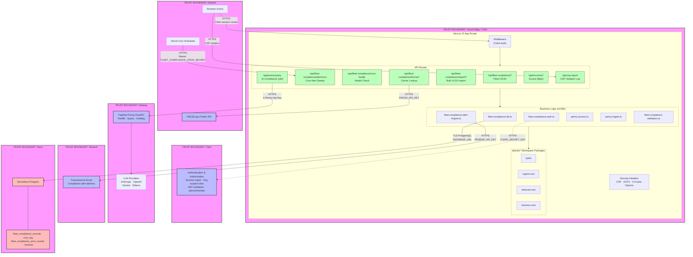

# System Boundary Diagram — PipelineX / Fleet-Compliance Sentinel

> SOC 2 Evidence | Phase 0 | Generated 2026-03-21

## Trust Boundary Overview

```
┌─────────────────────────────────────────────────────────────────────┐
│                        TRUST BOUNDARY: Internet                     │
│                                                                     │
│   ┌──────── ──┐    ┌──────────┐    ┌──────────────┐                 │
│   │  Browser  │    │  Vercel  │    │  FMCSA.gov   │                 │
│   │  (User)   │    │  Cron    │    │  Public API  │                 │
│   └─────┬─────┘    └────┬─────┘    └──────┬───────┘                 │
│         │               │                 │                         │
└─────────┼───────────────┼─────────────────┼─────────────────────────┘
          │ HTTPS         │ Bearer token    │ HTTPS + API key
          ▼               ▼                 │
┌─────────────────────────────────────────────────────────────────────┐
│                  TRUST BOUNDARY: Vercel Edge / CDN                  │
│                                                                     │
│  ┌────────────────────────────────────────────────────────────────┐ │
│  │  Next.js 15 Application (App Router)                           │ │
│  │                                                                │ │
│  │  ┌──────────────────┐   ┌──────────────────────────────────┐   │ │
│  │  │   Middleware      │   │   Security Headers (vercel.json)│   │ │
│  │  │   (Clerk auth)   │   │   CSP · HSTS · X-Frame-Options   │   │ │
│  │  └────────┬─────────┘   └──────────────────────────────────┘   │ │
│  │           │                                                    │ │
│  │  ┌────────▼─────────────────────────────────────────────────┐  │ │
│  │  │                     API Routes                           │  │ │
│  │  │                                                          │  │ │
│  │  │  /api/fleet-compliance/*          Fleet management CRUD             │  │ │
│  │  │  /api/fleet-compliance/alerts/run Cron-triggered alert sweep        │  │ │
│  │  │  /api/fleet-compliance/cron-health Health check (admin only)        │  │ │
│  │  │  /api/fleet-compliance/fmcsa/*   FMCSA carrier lookup ──────────┐   │  │ │
│  │  │  /api/fleet-compliance/import/*   Bulk XLSX import pipeline     │   │  │ │
│  │  │  /api/penny/query      AI compliance Q&A proxy ───┐  │   │  │ │
│  │  │  /api/invoices/*       Invoice management         │  │   │  │ │
│  │  │  /api/csp-report       CSP violation collector    │  │   │  │ │
│  │  └────────┬───────────────────────────────────────┬───┼──┼───┘ │ │
│  │           │                                       │   │  │     │ │
│  │  ┌────────▼─────────────────────────────────────┐ │   │  │     │ │
│  │  │              Business Logic (src/lib/)        │ │   │  │     │ │
│  │  │                                               │ │   │  │     │ │
│  │  │  fleet-compliance-db.ts        DB operations             │ │   │  │     │ │
│  │  │  fleet-compliance-data.ts      Data loading              │ │   │  │     │ │
│  │  │  fleet-compliance-auth.ts      Role enforcement          │ │   │  │     │ │
│  │  │  fleet-compliance-alert-engine Alert classification      │ │   │  │     │ │
│  │  │  fleet-compliance-validators   Input validation          │ │   │  │     │ │
│  │  │  penny-access.ts    Penny role allowlist      │ │   │  │     │ │
│  │  │  penny-ingest.ts    Context builder           │ │   │  │     │ │
│  │  └────────┬──────────────────────────────────────┘ │   │  │     │ │
│  │           │                                        │   │  │     │ │
│  │  ┌────────▼──────────────────────────────────┐     │   │  │     │ │
│  │  │  Workspace Packages (@tnds/*)             │     │   │  │     │ │
│  │  │  types · ingest-core · retrieval-core     │     │   │  │     │ │
│  │  │  memory-core                              │     │   │  │     │ │
│  │  └───────────────────────────────────────────┘     │   │  │     │ │
│  └────────────────────────────────────────────────────────────────┘ │
│                                                       │   │  │      │
└───────────────────────────────────────────────────────┼───┼──┼──────┘
                                                        │   │  │
          ┌─────────────────────────────────────────────┘   │  │
          │                                                 │  │
          ▼                                                 │  │
┌──────────────────────────┐                                │  │
│  TRUST BOUNDARY: Clerk   │                                │  │
│                          │                                │  │
│  Authentication &        │                                │  │
│  Authorization SaaS      │                                │  │
│                          │                                │  │
│  • Session management    │                                │  │
│  • Org-scoped roles      │                                │  │
│  • JWT validation        │                                │  │
│  • admin / member roles  │                                │  │
└──────────────────────────┘                                │  │
                                                            │  │
          ┌─────────────────────────────────────────────────┘  │
          │                                                    │
          ▼                                                    │
┌──────────────────────────┐  ┌────────────────────────────┐   │
│  TRUST BOUNDARY: Railway │  │  TRUST BOUNDARY: Resend    │   │
│                          │  │                            │   │
│  Pipeline Penny          │  │  Transactional Email       │   │
│  FastAPI Service         │  │  (Alert notifications)     │   │
│                          │  │                            │   │
│  • /health               │  │  • API key auth            │   │
│  • /query (LLM proxy)    │  │  • Compliance alert emails │   │
│  • /catalog              │  │  • Dry-run if key absent   │   │
│                          │  │                            │   │
│  Auth: X-Penny-Api-Key   │  └────────────────────────────┘   │
│  Providers: Anthropic,   │                                   │
│    OpenAI, Gemini,       │                                   │
│    Ollama                │                                   │
└──────────────────────────┘                                   │
                                                               │
          ┌────────────────────────────────────────────────────┘
          │
          ▼
┌──────────────────────────────────┐
│  TRUST BOUNDARY: Neon            │
│                                  │
│  Serverless Postgres             │
│                                  │
│  Tables:                         │
│  • fleet_compliance_records (JSONB)         │
│  • cron_log (audit trail)        │
│  • fleet_compliance_error_events            │
│  • invoice tables                │
│                                  │
│  Auth: DATABASE_URL conn string  │
│  TLS: enforced                   │
└──────────────────────────────────┘
```

## Mermaid Diagram



## Data Flow Summary

| Flow              | Source             | Destination             | Protocol       | Auth Method                 |
| ----------------- | ------------------ | ----------------------- | -------------- | --------------------------- |
| User requests     | Browser            | Vercel (Next.js)        | HTTPS          | Clerk session cookie        |
| Cron trigger      | Vercel Scheduler   | `/api/fleet-compliance/alerts/run` | HTTPS          | Bearer `FLEET_COMPLIANCE_CRON_SECRET`  |
| DB operations     | Next.js API routes | Neon Postgres           | TLS PostgreSQL | Connection string           |
| Penny queries     | Next.js API        | Railway FastAPI         | HTTPS          | `X-Penny-Api-Key` header    |
| Alert emails      | Next.js API        | Resend API              | HTTPS          | `RESEND_API_KEY`            |
| FMCSA lookups     | Next.js API        | `mobile.fmcsa.dot.gov`  | HTTPS          | `FMCSA_API_KEY` query param |
| CSP reports       | Browser            | `/api/csp-report`       | HTTPS          | None (public endpoint)      |
| Auth verification | Next.js middleware | Clerk API               | HTTPS          | `CLERK_SECRET_KEY`          |

## Trust Boundary Definitions

| Boundary    | Owner                    | Controls                                    |
| ----------- | ------------------------ | ------------------------------------------- |
| Internet    | Public                   | No trust — all input validated at edge      |
| Vercel Edge | PipelineX team           | Middleware auth, CSP, security headers      |
| Clerk       | Clerk Inc. (3rd party)   | Session tokens, org membership, role claims |
| Neon        | Neon Inc. (3rd party)    | Data-at-rest encryption, TLS in transit     |
| Railway     | Railway Inc. (3rd party) | Penny API isolation, LLM provider routing   |
| Resend      | Resend Inc. (3rd party)  | Email delivery, sender verification         |
| FMCSA       | US DOT (government)      | Public carrier safety data                  |

## Secrets Inventory

| Secret              | Storage                   | Rotation         |
| ------------------- | ------------------------- | ---------------- |
| `CLERK_SECRET_KEY`  | Vercel env vars           | Clerk dashboard  |
| `DATABASE_URL`      | Vercel env vars           | Neon dashboard   |
| `PENNY_API_KEY`     | Vercel + Railway env vars | Manual           |
| `FLEET_COMPLIANCE_CRON_SECRET` | Vercel env vars           | Manual           |
| `RESEND_API_KEY`    | Vercel env vars           | Resend dashboard |
| `FMCSA_API_KEY`     | Vercel env vars           | FMCSA portal     |
