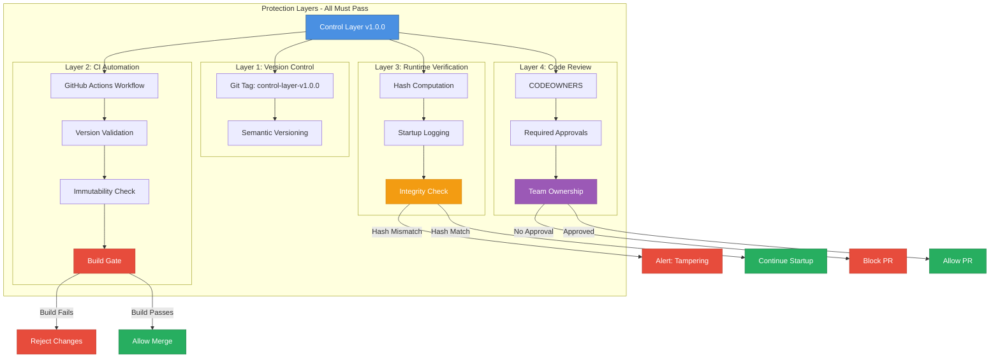

# Control Layer Architecture

## System Overview

```
┌─────────────────────────────────────────────────────────────────┐
│                      TNDS Platform Startup                       │
│                                                                   │
│  1. Call initialize()                                            │
│     ├─> Load Constitution (docs/CONSTITUTION.md)                 │
│     │   └─> Verify integrity                                     │
│     │                                                             │
│     └─> Load Control (ai/control/prompt-registry.v1.0.0.json)   │
│         ├─> Validate immutability marker                         │
│         ├─> Validate each prompt (prompt-validator.ts)           │
│         └─> Verify integrity                                     │
│                                                                   │
│  2. Fail fast if any step fails                                  │
│  3. Return frozen artifacts                                      │
└─────────────────────────────────────────────────────────────────┘
```

## Layer Separation

```
┌──────────────────────────────────────────────────────────────────┐
│                        GOVERNANCE LAYER                           │
│  ┌────────────────┐  ┌────────────────┐  ┌────────────────┐     │
│  │  Constitution  │  │    Control     │  │   Validators   │     │
│  │   (frozen law) │  │  (authority)   │  │  (148 rules)   │     │
│  └────────────────┘  └────────────────┘  └────────────────┘     │
│         │                    │                    │              │
│         └────────────────────┼────────────────────┘              │
│                              ↓                                   │
│                    ┌────────────────┐                            │
│                    │      EAG       │                            │
│                    │ (sole authority)│                           │
│                    └────────────────┘                            │
│                              │                                   │
└──────────────────────────────┼───────────────────────────────────┘
                               ↓
┌──────────────────────────────────────────────────────────────────┐
│                       EXECUTION LAYER                             │
│  ┌────────────────┐  ┌────────────────┐  ┌────────────────┐     │
│  │    Runtime     │  │  Orchestrator  │  │   Execution    │     │
│  │   (executes)   │  │ (coordinates)  │  │    (flows)     │     │
│  └────────────────┘  └────────────────┘  └────────────────┘     │
└──────────────────────────────────────────────────────────────────┘
```

## Control Layer Data Flow

```
┌─────────────────────────────────────────────────────────────────┐
│                    ai/control/ (immutable)                       │
│                                                                   │
│  prompt-registry.v1.0.0.json  ← IMMUTABLE (frozen_at timestamp) │
│  prompt.schema.json                                              │
│  prompt-router.json                                              │
│  runtime-policy.json                                             │
│  prompt-bundles.json                                             │
│  agent-orchestration.json                                        │
└─────────────────────────────────────────────────────────────────┘
                               │
                               │ Load at startup
                               ↓
┌─────────────────────────────────────────────────────────────────┐
│              src/control/loader.ts (singleton)                   │
│                                                                   │
│  1. Read prompt-registry.v1.0.0.json                             │
│  2. Verify status === "immutable"                                │
│  3. Verify meta.version === "1.0.0" (version pin)                │
│  4. Validate each prompt (prompt-validator.ts)                   │
│  5. Compute SHA-256 hash                                         │
│  6. Object.freeze() all artifacts recursively                    │
│  7. Assert !Object.isExtensible() (freeze assertion)             │
│  8. Store in singleton                                           │
└─────────────────────────────────────────────────────────────────┘
                               │
                               │ Expose via accessors
                               ↓
┌─────────────────────────────────────────────────────────────────┐
│                    Runtime Access (read-only)                    │
│                                                                   │
│  getControl()              → All control artifacts               │
│  getPromptById(id)         → Specific prompt (by authority)      │
│  getPromptsByProtocol(p)   → Filter by protocol                  │
│  getPromptsByTier(t)       → Filter by tier                      │
│                                                                   │
│  ✓ Frozen (immutable)                                            │
│  ✓ Validated (at load)                                           │
│  ✓ Integrity-checked (hash)                                      │
│  ✗ NOT searchable by agents                                      │
│  ✗ NOT modifiable at runtime                                     │
└─────────────────────────────────────────────────────────────────┘
```

## Control vs. Knowledge

```
┌─────────────────────────────────────────────────────────────────┐
│                         ai/control/                              │
│                     (Command Authority)                          │
│                                                                   │
│  • Selected by authority, not searched                           │
│  • Immutable at runtime                                          │
│  • Loaded at startup                                             │
│  • Validated once                                                │
│  • NOT exposed to vector search                                  │
│  • NOT exposed to embeddings                                     │
│  • Agents receive prompts, don't discover them                   │
│                                                                   │
│  Use case: Runtime prompt selection, routing, policy             │
└─────────────────────────────────────────────────────────────────┘

┌─────────────────────────────────────────────────────────────────┐
│                      tnds-knowledge/                             │
│                    (Reference Library)                           │
│                                                                   │
│  • Searched by agents                                            │
│  • Indexed for retrieval                                         │
│  • Embedded for similarity                                       │
│  • Discoverable                                                  │
│  • NOT command authority                                         │
│                                                                   │
│  Use case: RAG, context enrichment, reference material           │
└─────────────────────────────────────────────────────────────────┘
```

## File Structure

```
tnds-platform/
├── ai/
│   └── control/                    ← Control artifacts (immutable)
│       ├── prompt-registry.v1.0.0.json
│       ├── prompt.schema.json
│       ├── prompt-router.json
│       ├── runtime-policy.json
│       ├── prompt-bundles.json
│       └── agent-orchestration.json
│
├── src/
│   ├── startup/                    ← NEW: Platform initialization
│   │   ├── initialize.ts           │  Loads constitution + control
│   │   └── index.ts                │  Fails fast on error
│   │
│   ├── control/                    ← NEW: Control layer loader
│   │   ├── loader.ts               │  Mirrors constitution loader
│   │   └── index.ts                │  Provides accessors
│   │
│   ├── constitution/               ← Existing: Constitution loader
│   ├── validators/                 ← Existing: Includes prompt-validator.ts
│   ├── eag/                        ← Existing: Execution Authority Gate
│   ├── runtime/                    ← Existing: Runtime execution
│   └── index.ts                    ← MODIFIED: Exports startup + control
│
├── examples/
│   └── control-layer-usage.ts      ← NEW: Usage examples
│
├── tests/integration/
│   └── control-layer.test.ts       ← NEW: Integration tests
│
└── docs/
    ├── control-layer-integration.md    ← NEW: Integration docs
    └── control-layer-architecture.md   ← NEW: This file
```

## Initialization Sequence

```
Application Start
      │
      ↓
┌─────────────────┐
│  initialize()   │  ← src/startup/initialize.ts
└─────────────────┘
      │
      ├─> loadConstitution()
      │   ├─> Read docs/CONSTITUTION.md
      │   ├─> Compute hash
      │   ├─> Object.freeze()
      │   └─> Verify integrity
      │
      ├─> loadControl()
      │   ├─> Read ai/control/prompt-registry.v1.0.0.json
      │   ├─> Verify immutability marker
      │   ├─> Verify version pin (meta.version === '1.0.0')
      │   ├─> Validate each prompt (prompt-validator.ts)
      │   ├─> Compute hash
      │   ├─> Object.freeze() recursively
      │   ├─> Assert freeze succeeded (!Object.isExtensible)
      │   └─> Verify integrity
      │
      └─> Return InitializationResult
          ├─> success: true
          ├─> constitutionLoaded: true
          ├─> controlLoaded: true
          ├─> constitutionIntegrity: true
          └─> controlIntegrity: true
```

## Control Layer Hardening Architecture

The control layer is protected by four enforcement layers that work together to prevent unauthorized changes.

**All layers must pass for execution to proceed.**



### Enforcement Layers Explained

**Layer 1: Version Control**

- Git tags provide immutable version history
- Semantic versioning enforces intentional changes
- Audit trail for all control layer modifications

**Layer 2: CI Automation**

- GitHub Actions workflow detects control layer changes
- Validates version bump occurred
- Checks immutability markers present
- **Fails build** if violations detected

**Layer 3: Runtime Verification**

- SHA-256 hash computed at load time
- Hash logged at startup for audit
- Integrity check verifies no tampering
- **Fails startup** if hash mismatch

**Layer 4: Code Review**

- CODEOWNERS requires approval from platform admins
- GitHub enforces review requirements
- Cannot merge without approval
- **Blocks PR** if not approved

### AND-Relationship

All four layers must pass:

- ✅ Version tag exists
- ✅ CI validation passes
- ✅ Runtime integrity verified
- ✅ Code review approved

If **any** layer fails, the change is rejected.

---

## Governance Guarantees

✓ **Immutability**: All control artifacts frozen with Object.freeze() recursively
✓ **Freeze Assertion**: Object.isExtensible() check prevents future refactors from breaking immutability
✓ **Version Pin**: Enforces meta.version === '1.0.0' to prevent accidental version drift
✓ **Validation**: All prompts validated at load time using prompt-validator.ts
✓ **Integrity**: SHA-256 hash verification
✓ **Fail-Closed**: Throws on any error, no fallbacks, no defaults
✓ **Isolation**: Not exposed to vector search or agent discovery
✓ **Authority**: Prompts selected by authority, not searched
✓ **Singleton**: Load once, never reload
✓ **Non-Invasive**: No changes to existing governance code
✓ **Battle-Hardened**: Four layers of automated protection (see diagram above)
