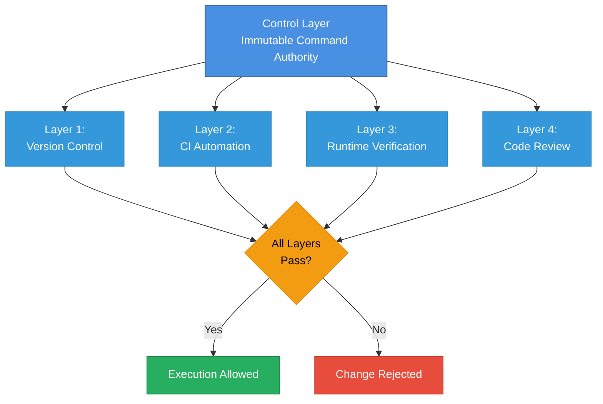

# Control Layer Enforcement - Simplified View

## For Presentations, Pitches, and Executive Summaries

This is a simplified version of the control layer enforcement architecture, suitable for:
- Government clients
- Security-conscious SMBs
- Internal stakeholders
- Executive presentations
- Sales pitches

---

## Four-Layer Protection Model

---

## What This Means

### The Control Layer
- Contains all system-level instructions for AI agents
- Defines what AI can and cannot do
- Cannot be modified by AI or discovered through search
- Loaded at startup, frozen in memory

### Four Enforcement Layers

**All four layers must pass for any change to be accepted.**

1. **Version Control**
   - Every change is tagged and tracked
   - Complete audit trail
   - Easy rollback to known-good state

2. **CI Automation**
   - Automated validation on every change
   - Checks version bumps and immutability
   - Build fails if rules violated

3. **Runtime Verification**
   - Cryptographic hash verification
   - Logged at every startup
   - Detects tampering immediately

4. **Code Review**
   - Human approval required
   - Platform administrators only
   - Cannot be bypassed

---

## Key Benefits

### Security
- ✅ Four independent layers of protection
- ✅ Cryptographic integrity verification
- ✅ Automated enforcement (no human error)
- ✅ Complete audit trail

### Compliance
- ✅ All changes tracked and logged
- ✅ Required approvals enforced
- ✅ Immutability guaranteed
- ✅ Audit-ready documentation

### Reliability
- ✅ Fail-safe design (rejects on any violation)
- ✅ No backdoors or bypasses
- ✅ Automated testing on every change
- ✅ Easy rollback capability

---

## Real-World Scenarios

### Scenario 1: Unauthorized Modification Attempt
1. Developer tries to modify control layer
2. **Layer 2 (CI)** detects no version bump → Build fails
3. Change rejected before reaching production
4. Alert sent to administrators

### Scenario 2: Tampering Detection
1. Control layer file modified on server
2. **Layer 3 (Runtime)** detects hash mismatch at startup
3. Application refuses to start
4. Alert logged for investigation

### Scenario 3: Proper Change Process
1. Administrator creates new version
2. **Layer 1 (Version Control)** tags the release
3. **Layer 2 (CI)** validates all checks pass
4. **Layer 4 (Code Review)** requires approval
5. **Layer 3 (Runtime)** verifies integrity
6. Change accepted and deployed

---

## Technical Foundation

This is not theoretical - it's implemented and enforced:

- **Version Control**: Git tags with semantic versioning
- **CI Automation**: GitHub Actions workflow
- **Runtime Verification**: SHA-256 cryptographic hashing
- **Code Review**: GitHub CODEOWNERS enforcement

All layers are automated and cannot be disabled.

---

## Comparison to Traditional Approaches

| Approach | Protection | Audit Trail | Automation | Bypasses |
|----------|-----------|-------------|------------|----------|
| **Manual Review Only** | Low | Partial | None | Easy |
| **CI Only** | Medium | Good | Partial | Possible |
| **Our Four-Layer Model** | **High** | **Complete** | **Full** | **None** |

---

## Bottom Line

**The control layer cannot be modified without:**
1. Creating a new version (tracked)
2. Passing automated validation (enforced)
3. Cryptographic verification (guaranteed)
4. Human approval (required)

**If any layer fails, the change is rejected.**

This is governance you can prove, not just promise.

---

## For More Details

- **Technical Architecture**: [control-layer-architecture.md](control-layer-architecture.md)
- **Implementation Guide**: [control-layer-hardening.md](control-layer-hardening.md)
- **Quick Start**: [control-layer-quickstart.md](control-layer-quickstart.md)
- **Complete Summary**: [../HARDENING_COMPLETE.md](../HARDENING_COMPLETE.md)

