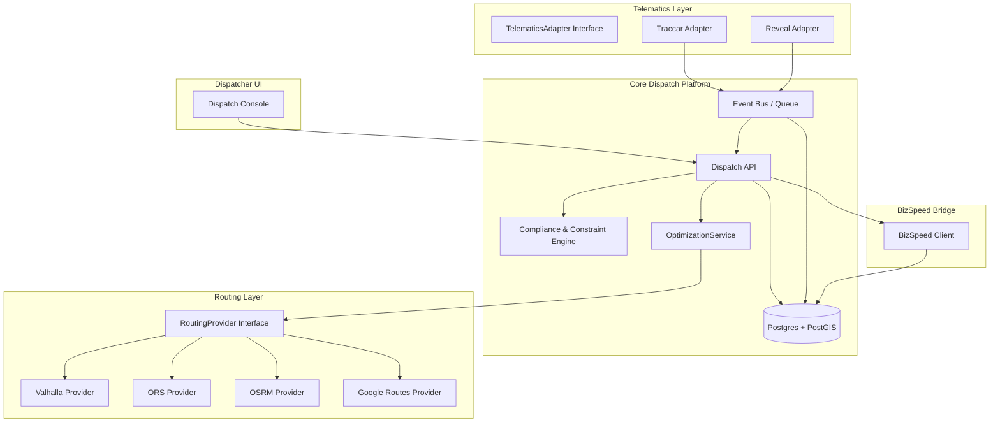

# Cost-Effective Fuel Dispatch Routing Platform for Colorado Hazmat and Tankwagon Operations

## Executive summary

You’re building (or modernizing) a **local-area dispatch + routing platform** for **tankwagon and transport fuel deliveries** that must handle **hazmat-aware and truck-aware routing in Colorado**, **multi-compartment truck inventory**, and **telematics integrations** (Traccar and Verizon Connect Reveal). The best “cost-effective + controllable” path for a Colorado-first build is a **hybrid architecture**:

A self-hosted routing/optimization stack that uses **OpenStreetMap (OSM) extracts** as the base road network (with correct **ODbL attribution/compliance**) while ingesting **Colorado CDOT HazMat routing layers** as authoritative overlays, plus a modular adapter layer that can swap routing providers (Valhalla/ORS/OSRM/Google) and telematics sources (Traccar/Reveal). OSM usage requires attribution and license signaling (ODbL) when you publicly use OSM-derived products. citeturn4search3turn4search11

For routing engines, the strongest “truck + hazmat parameter support” among common open-source stacks for dispatch is **Valhalla** (built-in `truck` costing, including a `hazmat` flag and vehicle dimension/weight parameters) and **OpenRouteService (ORS)** with its `driving-hgv` profile and explicit `hazmat` boolean routing restriction in profile parameters. citeturn36view0turn8view0

For managed-provider routing, **Google Routes API** is excellent operationally (global infra, traffic-aware matrix streaming via gRPC), but you must design around **Compute Route Matrix limits (625 elements non-transit; lower caps for traffic-aware optimal)** and accept that it does **not advertise built-in hazmat legal route registry overlays**; you would still need to enforce CDOT/FMCSA hazmat routing constraints yourself with polygons/avoidance logic (or an external compliance layer). citeturn24view3turn37search1turn33search4

Cost-wise, at typical volumes for local dispatch, the biggest managed-provider cost driver is **matrix elements**. On Google’s public price list, **Routes: Compute Route Matrix Essentials** is billed per 1,000 events with a **10,000 free cap**, then **$5.00/1,000** up to 100k events, etc. citeturn20view0turn24view3 Under a Medium scenario (10 routes/day × 30 stops), you should expect **~288k matrix elements/month**, or roughly **~$1.2k/month** just for matrix, before any additional product SKUs. (Model shown below.)

On the fuel-domain side, BizSpeed MobileHub provides concrete primitives you can align to your data model: **Trips** (loads + orders + activities), **Loads** (terminal pickup + compartment/product compatibility using `CompartmentID` and `itemSubGroupName`), and **Orders** (line items, UOM, route zones, depot assignment). citeturn39view2turn39view0turn39view1 A robust integration plan is to treat BizSpeed as an ERP/dispatch-system-of-record and build a **BizSpeed bridge** that translates your core “Dispatch Work Orders” and “Truck Compartment Inventory” into BizSpeed’s `AddUpdate...` endpoints, with a “no surprises” rule: BizSpeed warns that when you send a trip update, **anything omitted can be removed**—so your integration must always send a full updated trip snapshot, not partial deltas. citeturn39view2

## Routing options and recommendations

### Comparison table of routing engines and managed providers

The table below focuses on what matters for fuel/tankwagon: truck dimensions, hazmat routing hooks/flags, customization depth, licensing/terms, and practical local-area operations.

| Option | Core capabilities | Truck + hazmat support (as documented) | Licensing / terms | Ops profile (local-area) | Typical infra/RAM needs | Customization effort | Local-area recommendation |
|---|---|---|---|---|---|---|---|
| OSRM | Very fast routing engine; profile-based routing using OSM; supports custom profiles. citeturn9search7turn9search10 | No first-party “hazmat registry” concept. Truck behavior requires custom profiles; community “truck-soft” profile warns heavy-vehicle tags are largely missing in OSM and routes may not respect legal access. citeturn10view0turn9search10 | BSD 2-clause (per OSRM project site). citeturn9search7 | Excellent for a fixed region; very stable for high request volume; heavier preprocessing pipeline (MLD/CH). citeturn21search10turn21search6 | Planet-scale example: 128 GB RAM and large disk for all-US/planet workflows; regional extracts much smaller but still require ample RAM for build + caching. citeturn1search0 | Medium–High (profiles + careful OSM tagging assumptions). | Good if you already know OSRM and accept “best-effort truck rules” + overlay your own hazmat constraints. |
| Valhalla | Route + matrix + map-matching; JSON REST APIs; dynamic costing (change costing per request without rebuilding tiles). citeturn27view0turn35search6turn27view2 | Built-in `truck` costing checks truck access/width/height/weight; truck costing options include `hazmat` boolean, axle load/count, and “truck route preference” options. citeturn36view0turn36view1 | MIT. citeturn1search5 | Very strong “dispatch engine” fit: you can self-host for Colorado extract and build matrices locally (`/sources_to_targets`). citeturn27view2turn28view0 | No single canonical RAM figure in docs for every region; operationally modest for a state extract; tile building can be heavy at large scale. citeturn21search9turn21search8 | Medium (tile build + ops), Low–Medium for per-request customization due to dynamic costing. citeturn35search6 | **Top pick for self-hosted, Colorado-first, truck+hazmat-capable routing core.** |
| GraphHopper (open-source engine) | Routing engine with commercial ecosystem; core is open source. (Primary repo is Apache-2.0.) citeturn1search2 | Open-source docs in this research set do not clearly assert hazmat routing or FMCSA/CDOT overlay support; treat truck/hazmat as “requires customization or commercial modules” unless verified in vendor docs. citeturn1search2 | Apache-2.0. citeturn1search2 | Good general routing stack; assess if truck/hazmat needs push you into paid tier. | Typically moderate; depends on region size and chosen contraction / preparation. | Medium | Viable if you want Apache licensing and are OK validating truck/hazmat feature set separately. |
| OpenRouteService (ORS) | Full routing API suite built around profiles; provides “driving-hgv” profile and advanced routing options; also documents heavy system requirements for full-planet. citeturn8view0turn1search3 | `driving-hgv` supports restrictions for length/width/height/axleload/weight and includes `hazmat` boolean (“appropriate routing for delivering hazardous goods and avoiding water protected areas”). citeturn8view0 | GPLv3 (license file). citeturn7view1 | Works well self-hosted; license posture needs review if you plan to distribute/modify; can also use hosted ORS API but then you’re not “local data only.” | Planet build guidance: 128 GB RAM for full dataset and large disk; state extract significantly smaller but still non-trivial. citeturn1search3 | Medium (ops) + careful license governance. | Strong routing quality; consider if GPL constraints are acceptable for your product plan. |
| Google Routes API (managed) | Compute Routes + Compute Route Matrix; REST POST endpoints; matrices have strict element limits and field-mask requirements; high reliability. citeturn37search11turn24view2turn24view3turn23search3 | Google docs here emphasize avoid tolls/highways/ferries and “vehicleInfo” for eco-friendly routing, but do **not** document hazmat legal routing overlays (FMCSA/CDOT) in the examined official pages. citeturn37search1 | Google Maps Platform terms + pay-as-you-go SKUs; EEA terms apply for EEA billing addresses. citeturn24view2turn20view0 | Minimal ops burden; you must engineer around element caps (625 typical) and possible traffic-aware constraints. citeturn24view3 | No self-host infra; costs are usage-based. | Low customization for true truck/hazmat unless you build overlays yourself. | Best if you want “fastest time-to-value” and can accept ongoing matrix costs + build your own hazmat constraints layer. |

### Practical recommendation for a Colorado-first fuel dispatch system

For fuel/tankwagon, routing is not just “fastest drive.” You need to honor: truck physical constraints, hazmat restrictions and designated routes, depot/terminal workflows, and compartment-level product compatibility. That pushes you toward a stack where you can:

Embed truck/hazmat parameters at the routing-engine level (Valhalla/ORS) and implement authoritative hazmat overlays (CDOT layers) as an additional constraint system.

**Recommended primary routing engine:** **Valhalla self-hosted for Colorado** + optional ORS as a secondary provider (or comparative test harness). Valhalla’s docs explicitly define truck costing, including a `hazmat` flag and truck route preference derived from OSM `hgv=designated`. citeturn36view0turn36view1 ORS explicitly defines `driving-hgv` restrictions including `hazmat`. citeturn8view0

**Recommended optimizer:** **VROOM** for VRP construction + cost evaluation using your routing engine’s matrix, because VROOM is a purpose-built open-source VRP engine (BSD-2-Clause) and clearly defines input structures (vehicles/jobs/shipments) and outputs (routes with steps). citeturn25view2turn22search3turn26view0turn26view3 Optionally layer **OR-Tools** for specialized constraints (e.g., multi-dimensional capacity, custom penalty structures), which is Apache-2.0. citeturn3search12

**Managed fallback:** integrate Google Routes API for (a) quick initial deployments where compliance constraints are “soft,” and (b) a “sanity check” provider when local routing is degraded—while still enforcing your hazmat overlays independently. Google matrix hard limits (625) must be respected in your adapter. citeturn24view3

## Cost model scenarios: Google Routes vs self-hosted

### Assumptions and formulas

You shared three scenario shapes, interpreted as:

Low: **5 routes/day × 20 stops/route**  
Medium: **10 routes/day × 30 stops/route**  
High: **30 routes/day × 50 stops/route**

Dispatch VRP typically needs a **time/distance matrix**. For a single vehicle route with `S` stops plus 1 depot/terminal origin, matrix locations `N = S + 1`. A full square matrix element count is:

`elements_per_route = N × N = (S + 1)^2`

Monthly elements (assuming 30 days for comparison):

`monthly_elements = elements_per_route × routes_per_day × 30`

Google’s official pricing list for **Routes: Compute Route Matrix Essentials** shows: free cap 10,000 monthly events, then $5.00 per 1,000 events up to 100,000, then $4.00/1,000 to 500,000, then $3.00/1,000 to 1,000,000, then $1.50/1,000 to 5,000,000, then $0.38/1,000 above that. citeturn20view0 Google defines “elements” as origins × destinations. citeturn24view3

Also note: Google’s Compute Route Matrix enforces **max 625 elements** for non-transit requests and lower caps for traffic-aware optimal routing. This affects request splitting but (usually) not total element billing. citeturn24view3

### Monthly matrix cost examples for Google Routes

The table below estimates **matrix-only** SKU spend (Essentials tier) for the scenarios.

| Scenario | Routes/day × Stops/route | N = stops+1 | Elements/route (N²) | Monthly elements (×30 days) | Approx monthly matrix cost |
|---|---:|---:|---:|---:|---:|
| Low | 5 × 20 | 21 | 441 | 66,150 | ~$280.75 |
| Medium | 10 × 30 | 31 | 961 | 288,300 | ~$1,203.20 |
| High | 30 × 50 | 51 | 2,601 | 2,340,900 | ~$5,561.35 |

These costs are driven by Google’s published per-1,000 event prices and the 10,000 free usage cap. citeturn20view0turn24view3

**ComputeRoutes requests (polylines) are typically not the main cost** at these volumes because **Compute Routes Essentials** also has a 10,000 free cap and is $5/1,000 thereafter, meaning a few thousand route-polyline calls/month often remain within free usage. citeturn20view0turn24view2 But beware the **25 intermediate waypoint limit** for `computeRoutes`, and billing changes when you use 11+ intermediates. citeturn9search2

### Self-hosted cost model examples

Self-hosted costs are mostly fixed and come from:

`monthly_cost_self_host = compute + storage + backups + ops_labor`

Where traffic-based API costs are near-zero beyond your cloud network egress and compute. For storage, Google’s disk pricing page gives a reference example of **$0.080 per GiB-month** for a disk rate used in an example calculation. citeturn21search3

A practical way to frame self-hosting costs is by “bundle sizing” rather than pretending precision without your target SLA:

Low: Single VM “router + optimizer + DB” (state extract)  
Medium: Split into (1) routing/optimizer VM + (2) Postgres VM  
High: Dedicated routing cluster + DB HA + warm standby + monitoring/alerts

Because official VM hourly prices vary by region and machine family, treat compute cost as a priced variable (`vm_rate_per_hour`) and calculate:

`compute_monthly = vm_rate_per_hour × 730 × vm_count`

**Break-even intuition:** At Medium and High, Google matrix costs become material ($1.2k–$5.6k/month in the examples), which is often enough to fund several mid-sized VMs plus operational time, especially if your routing is local-area and you cache aggressively. The deciding factor becomes whether you can reliably enforce hazmat/truck constraints and maintain uptime with your team.

## BizSpeed multi-compartment inventory integration plan

### What BizSpeed provides that aligns with your fuel workflow

BizSpeed’s dispatching concepts align well to fuel distribution: it explicitly models **trucks/trailers**, **terminals (where you load)**, **depots (where trucks are domiciled/start-end)**, and **trips** as a route/set of loads and orders for a truck and driver. citeturn38search16turn39view2

From MobileHub’s API perspective, BizSpeed gives you three key integration levers:

- `AddUpdateLoadsWithoutTrips`: push **terminal load stops** and (optionally) detailed load lines including `CompartmentID`, `ItemID`, `QtyToLoad`, and `itemSubGroupName` (product compatibility). citeturn39view0  
- `AddUpdateOrdersWithoutTrips`: push **delivery orders** into the “order well” for routing, with required details like `orderNo`, ship/bill addresses, and line items (`itemID`, `lineNum`, `orderQty`, `UOM`, etc.). citeturn39view1  
- `AddUpdateTrip`: create or replace a full trip with **loads + orders + activities**, and bind that trip to `VehicleCode` (truck ID), `TrailerCode`, and optionally a depot (`SiteID`). citeturn39view2

A critical behavior: when updating a trip via `AddUpdateTrip`, BizSpeed states that if you resend a trip and omit items that previously existed, **those omitted items are removed**. So your bridge must send a full **authoritative snapshot** of the trip every time, not “diff-only” updates. citeturn39view2

### Endpoint usage and field mapping for multi-compartment fuel delivery

#### BizSpeed endpoint: AddUpdateLoadsWithoutTrips

BizSpeed’s load stop constructs map naturally to “terminal pickup + compartment fill”:

- `LoadTicketID`: primary identifier; drivers enter BOL for each line item. citeturn39view0  
- `TerminalID` and (optionally) terminal address + lat/lon. citeturn39view0  
- Load detail lines: `ItemID`, description, `QtyToLoad`, and optional `CompartmentID`. If a compartment is included, BizSpeed matches on `itemID` + `compartmentID`; if not, it matches using supplier and item. citeturn39view0  
- `itemSubGroupName` supports product compatibility management (BizSpeed example: items with subgroup DDSL can be pumped into an asset with the same subgroup). citeturn39view0

#### BizSpeed endpoint: AddUpdateOrdersWithoutTrips

Orders map to fuel drops and wet-hose/tank drops:

Required fields include `accountNo`, `orderNo`, ship/bill addresses, `customerName`, and order details including `itemID`, `itemDescription`, `lineNum`, `orderQty`, and `UOM`. citeturn39view1

BizSpeed also supports delivery-ticket “customer item” identifiers (harmonized lubes use case) and a PCS-to-QTY multiplier pattern (e.g., 2×55 gallon drums delivered as 110 gallons). citeturn39view1

Latitude/longitude are optional; if missing, BizSpeed may geocode customers without GPS coordinates, which creates risk for hazmat routing precision if addresses are not routable. citeturn39view1

#### BizSpeed endpoint: AddUpdateTrip and UpdateTripEta

Use `AddUpdateTrip` to build the full run plan: trip code + scheduled start + arrays of orders/loads/activities. ETA ordering determines stop order in the driver list. citeturn39view2

Use `UpdateTripEta` to update ETAs for a trip already created, without forcing a full refresh; BizSpeed represents orders/loads/activities similarly via `stopId`, `eta`, and `etd` maps (stopId maps to order number / load ticket ID / activity action ID). citeturn40view1

### BizSpeed authentication and request enveloping

BizSpeed’s API uses a message envelope with `module`, `opcode`, and `authToken` containing `UserName`, `Password`, and `CompanyCode`. The `CheckLogin` endpoint shows the expected request/response structure and warns about account lockouts after invalid credential attempts. citeturn40view0

### Recommended data model changes in your dispatch platform

To support multi-compartment trucks + BizSpeed mapping cleanly, add/standardize these core entities:

Vehicle compartments: per vehicle, define compartment identifier strings compatible with BizSpeed’s `CompartmentID` patterns (e.g., “1”, “2”, or “L1”, “R1”). citeturn39view0

Terminal loads: model a terminal load as its own stop type with `LoadTicketID`, `TerminalID`, and one-or-many load line items. BizSpeed explicitly models loads as terminal actions and allows creating terminals via loads. citeturn39view0

Delivery line items: represent each order line with `itemID`, `lineNum`, `orderQty`, `UOM`, and optional “customer item” mapping fields for harmonized products. citeturn39view1turn39view0

Product compatibility: preserve `itemSubGroupName` as a first-class attribute, to support BizSpeed compatibility management and to allow future constraints (“don’t assign incompatible products to the same compartment or asset”). citeturn39view0

## Telematics integration patterns for Traccar and Reveal

### Design goal: adapters, not one-off integrations

Treat telematics as “position + events + device metadata” streams that must be normalized into a single internal schema, regardless of vendor. Your platform should define a `TelematicsAdapter` interface, with two implementations:

TraccarAdapter: ingestion via forwarding (preferred) or API polling  
RevealAdapter: ingestion via Reveal APIs and/or GPS webhook integrations

### Traccar integration patterns

#### Pattern: Traccar forwarding into your ingestion endpoint

Traccar explicitly supports three forwarding flows: processed positions, generated events, and raw protocol traffic. citeturn11search0 It documents configuration like `forward.url` for position forwarding and event forwarding configuration with output format options including json/amqp/kafka/mqtt. citeturn13search3

This is the cleanest fit for a dispatch platform because it pushes data to you near real-time, without you polling.

#### Pattern: Traccar REST API polling / on-demand lookups

Traccar provides an API and documents multiple auth options: session cookies, standard HTTP auth header, and bearer token auth; it points to an API Reference and OpenAPI spec. citeturn4search0turn11search1

Use polling for “catch-up” (e.g., last known position, device list, static metadata) and for resiliency if forwarding is down.

#### Optional: Traccar WebSocket for real-time updates

Traccar has a `/api/socket` endpoint referenced in community/security materials; if you use it, treat it as optional and review security implications. citeturn19search9 Given Traccar already supports forwarding, forwarding is the safer and simpler default.

### Verizon Connect Reveal integration patterns

Reveal describes a process for creating API and webhook integrations via its marketplace/admin flows: customers may need to request “integration user credentials,” and integrations often require submitting endpoints for GPS webhooks; after endpoint submission, the developer has three days to confirm the request. citeturn11search13turn11search2turn4search2

For architecture, you should plan for two integration modes:

API integration mode: periodic pulls for trips, vehicles, positions (depending on available APIs and permissions) via the developer portal and integration credentials. citeturn4search10turn4search6

Webhook mode: ingest GPS data pushed to your endpoint, with credentials + basic auth style fields configured in Reveal’s “Submit endpoints” flow. citeturn4search2turn11search17

### Normalized streaming design

Define a normalized message:

- `provider` (traccar|reveal|other)
- `device_id` / `vehicle_id`
- `timestamp`
- `lat`, `lon`, `heading`, `speed`
- `event_type` (position_update, ignition_on/off, geofence_enter/exit, etc.)
- `raw_payload_ref` (store raw payload encrypted; do not log)

Then publish to an internal stream/bus (`telematics.events`) and update a “vehicle_state” table for fast dispatcher UI queries.

## Hazmat compliance and data governance for Colorado fuel routing

### Colorado designated hazmat routes and overlays

CDOT provides public hazmat routing guidance: **vehicles carrying placarded quantities must remain on designated hazardous materials routes** (general rule), and Colorado also references nuclear routing and compliance with federal provisions. citeturn33search4

You have multiple authoritative data products to ingest and use as overlays:

- CDOT “Hazardous and Nuclear Routes” GIS layer (ArcGIS item / Colorado Geospatial Portal listing). citeturn33search2turn33search3  
- HazMatMap PDF that includes designated hazardous materials routes and also designated gasoline/diesel/LPG routes plus legends and notes. citeturn0search2  
- County/city requirements layers for gas/diesel/LPG routing compliance (ArcGIS dataset listings). citeturn33search11turn33search20  
- CDOT open data portals support download formats and APIs (GeoJSON, WMS/WFS, etc.). citeturn33search0turn33search1

**Implementation note:** treat CDOT layers as an “authoritative constraint overlay” that can be applied as “must-use corridors” or “avoid outside corridor unless last-mile exception is triggered,” depending on your compliance policy and customer SOP.

### Federal hazmat routing framework and state registry

FMCSA provides a **National Hazardous Materials Route Registry** entry point, including state route listings (used by carriers and compliance programs). citeturn0search0

Federal regulation 49 CFR Part 397 covers hazardous materials driving and routing rules. For example, 49 CFR 397.3 states that if a state/local routing designation exists and is consistent with federal requirements, motor carriers of regulated hazardous materials must comply. citeturn0search13turn2search4

**This is the core legal logic you must respect in system behavior:** your dispatch ETA/route suggestions should not override hazmat routing constraints as “optional,” unless your compliance policy explicitly defines when and how last-mile exceptions are handled and documented.

### Data residency, privacy, and regulated-data posture

Driver location + customer delivery data is operationally sensitive. Your system should follow least privilege, encrypt location/event data at rest and in transit, and avoid storing raw PII in logs.

Using managed routing providers means you are sending address/coordinates and potentially stop sequencing to third parties (Google). Google’s terms and region rules (including separate EEA terms for EEA billing) can apply depending on customer geography. citeturn24view2turn20view0

### OSM licensing and attribution requirements

If you self-host routing using OSM/Geofabrik extracts, you must meet OSM’s attribution requirements and make clear the database is available under ODbL. citeturn4search3turn4search11

Geofabrik provides OSM data extracts (PBF/shapefiles) and notes their raw data files do not contain certain personal metadata fields. citeturn3search11turn3search15 Even so, you must still follow ODbL attribution and share-alike obligations for database derivatives as applicable. citeturn4search11turn4search7

## Reference architecture, implementation checklist, and testing

### Recommended stack for a modular core + plugin dispatch platform

**Routing engine (self-host):** Valhalla (primary) for truck/hazmat parameterization. citeturn36view0turn36view1  
**VRP optimizer:** VROOM (primary) due to clear VRP API + BSD-2-Clause licensing; optionally OR-Tools for specialized optimization constraints. citeturn25view2turn22search3turn3search12  
**Database:** Postgres + PostGIS (for geospatial overlays: CDOT layers, geofences, corridor checks).  
**Backend:** TypeScript (Node) or Python (FastAPI) is fine; choose what best aligns with your existing repo.  
**Deployment:** Docker-first (routing engine + optimizer), with IaC and environment-specific configs.

### Architecture diagram



Key routing/optimization interfaces should be “provider-shaped” so you can add industry plugins (tankwagon, transport, propane, lubes) without reworking the core.

### Data flow diagram for routing + compliance overlays

```mermaid
sequenceDiagram
  participant Dispatcher as Dispatcher UI
  participant API as Dispatch API
  participant Rules as Hazmat/Truck Rules Engine
  participant Router as RoutingProvider (Valhalla/ORS/OSRM/Google)
  participant Opt as Optimization (VROOM/OR-Tools)
  participant DB as PostGIS

  Dispatcher->>API: Create/Update Dispatch Plan (stops, vehicles, constraints)
  API->>Rules: Evaluate constraints (hazmat class, placards, vehicle dims)
  Rules->>DB: Fetch CDOT HazMat corridors + restricted polygons
  DB-->>Rules: Corridor geometries + rules
  Rules->>Router: Request matrix/route with truck/hazmat params + avoid polygons
  Router-->>Rules: Matrix + route legs
  Rules->>Opt: Solve VRP with capacities + time windows + terminal loading
  Opt-->>API: Sequenced routes + ETAs
  API-->>Dispatcher: Publish plan + compliance flags + ETAs
```

Valhalla provides route and matrix APIs with JSON inputs and includes explicit examples for route and matrix request shapes. citeturn28view0turn27view2turn27view0

### Module-level implementation checklist for a dispatch module like `tooling/dispatch-command`

Below is a concrete checklist for implementing provider adapters and a dispatch core. Adapt the paths to match your mono-repo layout (names shown are suggested).

**Routing provider contract and implementations**

- `tooling/dispatch-command/src/routing/RoutingProvider.ts`  
  Define an interface:
  - `getRoute(request): RouteResult`
  - `getMatrix(request): MatrixResult`
  - `healthCheck(): ProviderHealth`

- `tooling/dispatch-command/src/routing/providers/ValhallaProvider.ts`  
  Implement `/route` and `/sources_to_targets` calls. Valhalla docs show route JSON payload shape and matrix service usage. citeturn28view0turn27view2  
  Include truck costing options: height/width/length/weight + `hazmat`. citeturn36view0turn36view1

- `tooling/dispatch-command/src/routing/providers/OpenRouteServiceProvider.ts`  
  Implement ORS `/directions` and `/matrix`. ORS docs show HGV restrictions including `hazmat` boolean. citeturn8view0turn24view0  
  Include `driving-hgv` profile selection.

- `tooling/dispatch-command/src/routing/providers/OsrmProvider.ts`  
  Implement OSRM route/table calls for baseline routing. Keep truck routing as “best effort” unless you fully validate the profile; community truck “soft” profile warns OSM heavy-vehicle attributes can be poor and routes may not respect legal access. citeturn10view0turn9search10

- `tooling/dispatch-command/src/routing/providers/GoogleRoutesProvider.ts`  
  Implement `computeRoutes` and `computeRouteMatrix` (respect 625 element cap). citeturn24view3turn24view2  
  Enforce field masks (Google requires field masks). citeturn23search3turn23search4

- `tooling/dispatch-command/src/routing/HaversineFallback.ts`  
  Provide a fallback for approximate distance/time (guardrails: only for emergency estimation; never for hazmat compliance decisions).

**Optimization layer**

- `tooling/dispatch-command/src/optimization/OptimizationProvider.ts`  
  Contract:
  - `solve(problem): PlanSolution`
  - `validate(problem): ValidationReport`

- `tooling/dispatch-command/src/optimization/providers/VroomAdapter.ts`  
  VROOM expects `[lon, lat]`, seconds, meters; model vehicles with `capacity` arrays and jobs/shipments. citeturn25view2turn26view0  
  Parse solution routes/steps. citeturn26view3

- `tooling/dispatch-command/src/optimization/providers/OrToolsAdapter.ts`  
  Use for custom constraints not easily expressed in VROOM’s model; OR-Tools is Apache-2.0. citeturn3search12

**BizSpeed bridge**

- `tooling/dispatch-command/src/vendors/bizspeed/BizSpeedClient.ts`  
  Implement `CheckLogin`, `AddUpdateOrdersWithoutTrips`, `AddUpdateLoadsWithoutTrips`, `AddUpdateTrip`, `UpdateTripEta` message envelopes. citeturn40view0turn39view1turn39view0turn39view2turn40view1

- `tooling/dispatch-command/src/vendors/bizspeed/mappers/OrderMapper.ts`  
  Map your line items -> BizSpeed order DTO fields: `orderNo`, `lineNum`, `itemID`, `orderQty`, `UOM`, etc. citeturn39view1

- `tooling/dispatch-command/src/vendors/bizspeed/mappers/LoadMapper.ts`  
  Map terminal load -> BizSpeed load DTO: `LoadTicketID`, `TerminalID`, load details with `CompartmentID`, `QtyToLoad`, `itemSubGroupName`. citeturn39view0

- `tooling/dispatch-command/src/vendors/bizspeed/mappers/TripMapper.ts`  
  Ensure every update is a full trip snapshot (never partial), because omitted items are removed on resend. citeturn39view2

**Telematics adapters**

- `tooling/dispatch-command/src/telematics/TelematicsAdapter.ts`

- `tooling/dispatch-command/src/telematics/adapters/TraccarAdapter.ts`  
  Implement forwarding ingestion endpoints + optional REST polling. Traccar docs: forwarding supports processed positions/events/raw traffic and supports multiple forwarding types. citeturn11search0turn13search3  
  Use official API + OpenAPI for on-demand data pulls. citeturn4search0turn11search1

- `tooling/dispatch-command/src/telematics/adapters/RevealAdapter.ts`  
  Implement integration credential storage and webhook endpoint handling; support endpoint submission workflow. citeturn11search13turn11search2turn4search2

**Compliance overlay ingestion**

- `tooling/dispatch-command/src/compliance/cdot/HazmatLayersIngest.ts`  
  Pull CDOT hazmat layers (ArcGIS downloads) and store into PostGIS; treat as authoritative overlays. citeturn33search0turn33search2

- `tooling/dispatch-command/src/compliance/rules/HazmatRoutingPolicy.ts`  
  Enforce “stay on designated routes” rules for relevant shipments, aligned with CDOT guidance and 49 CFR Part 397 compliance. citeturn33search4turn0search13

### Example API snippets for routing and optimization

#### Valhalla route and matrix

Valhalla route request body example (from docs): citeturn28view0

```json
{
  "locations": [
    {"lat": 42.358528, "lon": -83.271400, "street": "Appleton"},
    {"lat": 42.996613, "lon": -78.749855, "street": "Ranch Trail"}
  ],
  "costing": "auto",
  "costing_options": {
    "auto": { "country_crossing_penalty": 2000.0 }
  },
  "units": "miles",
  "id": "my_work_route"
}
```

Valhalla matrix example shows `/sources_to_targets?json={...}` patterns and the structure of sources/targets with costing. citeturn27view2

#### OpenRouteService `driving-hgv` with hazmat

ORS HGV restrictions example includes `hazmat: true` under `options.profile_params.restrictions`. citeturn8view0

```json
{
  "coordinates": [[-104.9903, 39.7392], [-104.8214, 38.8339]],
  "profile": "driving-hgv",
  "options": {
    "profile_params": {
      "restrictions": {
        "length": 20,
        "height": 4.1,
        "weight": 30,
        "hazmat": true
      }
    }
  }
}
```

#### Google Routes Compute Routes and Compute Route Matrix

ComputeRoutes endpoint URL (docs): citeturn24view2

```http
POST https://routes.googleapis.com/directions/v2:computeRoutes
X-Goog-Api-Key: YOUR_KEY
X-Goog-FieldMask: routes.duration,routes.distanceMeters,routes.polyline.encodedPolyline
Content-Type: application/json
```

ComputeRouteMatrix limits (625 elements non-transit) are explicitly documented. citeturn24view3

#### VROOM optimization input/output

VROOM expects `[lon, lat]`, seconds, meters. citeturn25view2

Example input includes vehicles with `capacity`, time windows, and jobs. citeturn26view0

Example output includes `routes` with `steps` and arrival/distance/load changes. citeturn26view3

### Testing strategy and CI guidance

Unit tests should target deterministic business logic:

- Constraint evaluation (hazmat corridor enforcement, compartment compatibility rules).
- RoutingProvider adapter request formation (including element-capping logic for Google matrices). citeturn24view3
- BizSpeed mapping correctness (compartment IDs, item subgroup names, trip snapshot behavior). citeturn39view0turn39view2

Integration tests should run against:

- Local Docker Valhalla + VROOM stack (smoke test: matrix + solve + route render).
- Mocked Google Routes responses (don’t require real keys in CI).
- BizSpeed sandbox (if available) or contract tests based on published request/response envelopes (e.g., `CheckLogin`, `UpdateTripEta`). citeturn40view0turn40view1

Performance tests should validate:

- Matrix cache hit rates for repeat corridors.
- End-to-end solve time for Medium/High scenarios.
- Telemetry ingestion throughput from Traccar forwarding bursts. citeturn11search0

### Minimal cost/ops runbook for self-hosted Colorado Valhalla or OSRM

#### Data sourcing

Use a **Colorado OSM extract** from Geofabrik (PBF) to build your routing graph tiles. Geofabrik is the canonical download host for OSM regional extracts. citeturn3search11

OSM attribution and ODbL compliance is required for public use. citeturn4search3turn4search11

#### Suggested instance sizing (scenarios)

These are pragmatic starting points (you should benchmark with your actual stop volumes and concurrency):

Low: 8 vCPU / 32 GB RAM / 200–500 GB SSD  
Medium: 16 vCPU / 64 GB RAM / 500 GB–1 TB SSD (or split DB)  
High: dedicated routing VM(s) + DB HA + separate queue/worker nodes

ORS and OSRM docs show that planet-scale builds can be extremely memory heavy (e.g., OSRM guidance references 128 GB RAM for full-planet; ORS system requirements also cite very high RAM for planet). For Colorado-only, expect dramatically lower, but plan build-time headroom. citeturn1search0turn1search3

#### Build and serve (OSRM example pipeline)

OSRM supports MLD and CH preprocessing pipelines; official images recommend MLD by default except for special cases. citeturn21search10turn21search6

#### Tile build (Valhalla)

Valhalla’s “Mjolnir” tooling is designed for parsing OSM extracts and cutting routable graph tiles. citeturn21search9  
Valhalla APIs use REST with JSON request/response. citeturn27view0

#### Monitoring and ops

- Health endpoints: `RoutingProvider.healthCheck()` plus direct `/status` on Valhalla cluster.
- Cache: store computed matrices per (provider, vehicle profile parameters, polygon set hash).
- Geo overlay refresh: schedule periodic reload of CDOT layers (feature services) and version them.

### GitHub repos and vendor docs to ingest into `/docs/vendors/`

The following URLs are the most useful “primary sources” to capture into your repo knowledge base.

```text
Open-source routing engines / VRP:
- OSRM backend: https://github.com/Project-OSRM/osrm-backend
- OSRM profiles docs: https://github.com/Project-OSRM/osrm-backend/blob/master/docs/profiles.md
- OSRM community profiles (truck-soft warning about OSM HV tags): https://github.com/Project-OSRM/osrm-profiles-contrib/blob/master/5/21/truck-soft/README.md
- Valhalla: https://github.com/valhalla/valhalla
- Valhalla route API reference (docs): https://valhalla.github.io/valhalla/api/turn-by-turn/api-reference/
- Valhalla matrix API reference (docs): https://valhalla.github.io/valhalla/api/matrix/api-reference/
- OpenRouteService: https://github.com/GIScience/openrouteservice
- ORS routing options (driving-hgv + hazmat): https://giscience.github.io/openrouteservice/api-reference/endpoints/directions/routing-options
- VROOM: https://github.com/VROOM-Project/vroom
- VROOM API doc: https://github.com/VROOM-Project/vroom/blob/master/docs/API.md?plain=1
- Google OR-Tools: https://github.com/google/or-tools

Telematics:
- Traccar: https://github.com/traccar/traccar
- Traccar API docs: https://www.traccar.org/traccar-api/
- Traccar forwarding docs: https://www.traccar.org/forward/

Managed routing (Google):
- Routes API overview: https://developers.google.com/maps/documentation/routes
- Compute Routes doc: https://developers.google.com/maps/documentation/routes/compute_route_directions
- Compute Route Matrix doc: https://developers.google.com/maps/documentation/routes/compute_route_matrix
- Pricing list (Routes SKUs): https://developers.google.com/maps/billing-and-pricing/pricing

BizSpeed:
- BizSpeed MobileHub API root: https://apidocs.bizspeed.com/
- BizSpeed AddUpdateLoadsWithoutTrips: https://apidocs.bizspeed.com/api3PLexternal/AddUpdateLoadsWithoutTrips/
- BizSpeed AddUpdateOrdersWithoutTrips: https://apidocs.bizspeed.com/api3PLexternal/AddUpdateOrdersWithoutTrips/
- BizSpeed AddUpdateTrip: https://apidocs.bizspeed.com/api3PLexternal/AddUpdateTrip/
- BizSpeed UpdateTripEta: https://apidocs.bizspeed.com/api3PLexternal/UpdateTripEta/
- BizSpeed CheckLogin: https://apidocs.bizspeed.com/api3PLexternal/CheckLogin/
- BizSpeed dispatching docs: https://www.bizspeed.com/support/documentation/?section=dispatch-2

Colorado hazmat overlays:
- CDOT HazMatMap PDF: https://www.codot.gov/programs/research/pdfs/2014/13fixup.pdf
- CDOT Hazardous Routes overview page: https://ft-cdot.opendata.arcgis.com/pages/cdot%3A%3Ahazardous-routes
- Hazardous and Nuclear Routes layer: https://geodata.colorado.gov/datasets/57a06659a85e48f78d39e1a652efd3e6_0/explore
- Hazmat county requirements (gas/diesel/LPG): https://geodata.colorado.gov/datasets/84a7d71e195b4d84b1a12299744e6297_0/about
- Hazmat city requirements (gas/diesel/LPG): https://geodata.colorado.gov/datasets/cdot%3A%3Ahazmat-city-requirements-for-gas-diesel-liquefied-petroleum-gas

Fleet dispatch platforms (reference implementations / inspiration):
- Fleetbase: https://www.fleetbase.io/
- FleetOps extension repo: https://github.com/fleetbase/fleetops
- FleetPanda GitHub org: https://github.com/FleetPanda
```

Fleetbase positions itself as an open-source logistics platform and FleetOps repo includes a full “extension” structure and states MIT licensing in its README. citeturn22search16turn34view2 FleetPanda’s product positioning explicitly calls out **compartment-level inventory visibility**, reinforcing this as a first-class fuel dispatch need. citeturn22search2turn22search4

## Deliverables, acceptance criteria, and known limitations

### Deliverables

A complete first build should ship with:

A modular dispatch core with plugin-ready interfaces:
- `RoutingProvider`
- `OptimizationProvider`
- `TelematicsAdapter`
- `BizSpeedClient`
- `HazmatComplianceEngine`

A working “Colorado fuel dispatch baseline”:
- Import CDOT hazmat route layers into PostGIS and enforce as constraints. citeturn33search0turn33search2turn33search4
- Validate FMCSA registry alignment and document compliance policy for dispatchers. citeturn0search0turn0search13

A BizSpeed bridge that supports:
- Creating/updating orders and loads (including compartments + compatibility). citeturn39view0turn39view1
- Building full trips and maintaining snapshot semantics. citeturn39view2
- Sending ETA updates via `UpdateTripEta`. citeturn40view1

Telematics ingestion:
- Traccar forwarding endpoint + mapping. citeturn11search0turn13search3
- Reveal webhook endpoint stubs + integration credential flow support. citeturn11search13turn11search2

### Acceptance criteria

Routing and compliance:
- For a set of test loads (hazmat flagged) and known Colorado corridors, computed routes must not violate designated-route constraints except in explicitly documented last-mile exception cases, with audit logs of exception use. citeturn33search4turn0search2turn0search13
- Truck routing requests must pass through vehicle dimensions/weight settings to the routing engine when using Valhalla/ORS. citeturn36view0turn8view0

BizSpeed integration fidelity:
- Loads with `CompartmentID` must map correctly and preserve `itemSubGroupName` for compatibility. citeturn39view0
- Trip updates must never drop previously planned orders/loads due to partial update payloads. citeturn39view2

Telemetry:
- Traccar forwarding ingestion must handle bursts and maintain ordering per device timestamp. citeturn11search0
- Reveal webhook endpoint submission process and credential model must be documented and testable in a sandbox account. citeturn11search13turn11search2

### Known limitations to surface early

OSM-based truck/hazmat routing is only as good as the underlying map data; OSRM community truck profile documentation explicitly warns that heavy vehicle attributes can be poor and computed routes may not respect legal access rules. citeturn10view0 This is why authoritative overlays (CDOT layers) become essential for hazmat compliance in Colorado. citeturn33search4turn33search2

Google Compute Route Matrix hard limits (625 elements) require request chunking logic, and traffic-aware optimal matrices have stricter limits. citeturn24view3

OpenRouteService licensing is GPLv3; if you plan to distribute modified binaries or embed pieces, consult counsel and define a license strategy early. citeturn7view1